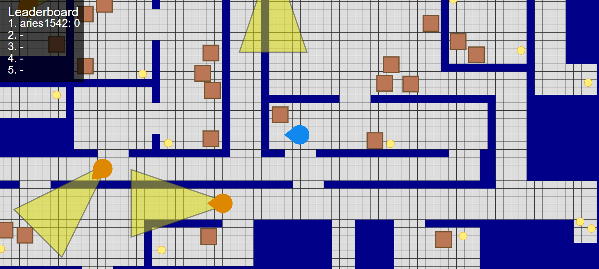

# Infiltrate
**Hosted at: infiltrate.aries1542.dev**

### Description

Senior Project for my Bachelor's Degree in Software Engineering at Utah Tech. A web based game where you sneak around avoiding AI enemies, made using two.js and Go. Compete by collecting more coins than your opponents, but be careful, because if you get caught, you're right back where you started. Large amounts of coins are placed in riskier areas, so you must decide whether to take the risk and rise up the leaderboard or wait for your opponents to slip up and lose it all.

#### Screenshots

